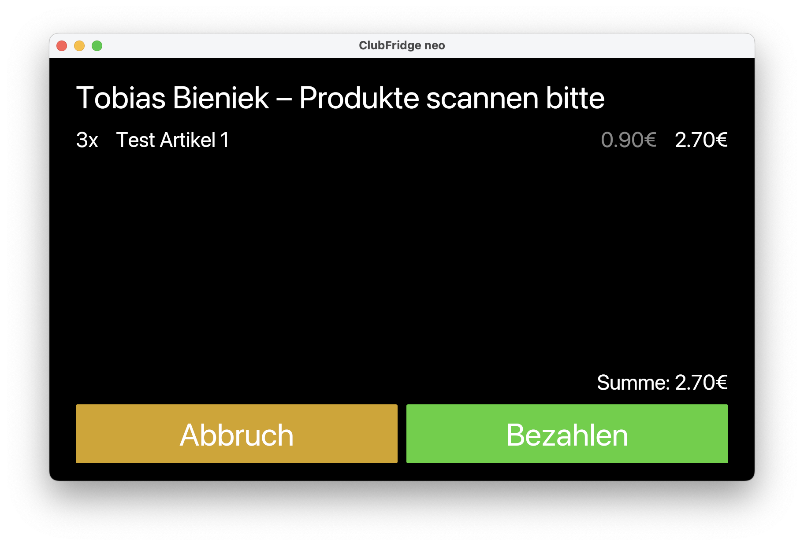

clubfridge-neo
==============================================================================

__Digital cash register for airsport clubs.__

This project is a reimplementation of the [Clubfridge](https://new.clubfridge.com/)
project, which was started in 2017 to make it easier for airsport clubs to
sell snacks and beverages to their members.

The original project was implemented with a dedicated cloud server, but these
days it is possible to save sales directly into the [Vereinsflieger](https://www.vereinsflieger.de/)
system, which is used by most airsport clubs in Germany.

The application is intended to run on a [Raspberry Pi](https://www.raspberrypi.org),
so ARM cross-compilation compatibility is a requirement for any changes.

License
-------------------------------------------------------------------------------

Licensed under either of

* Apache License, Version 2.0
  ([LICENSE-APACHE](LICENSE-APACHE) or http://www.apache.org/licenses/LICENSE-2.0)
* MIT license
  ([LICENSE-MIT](LICENSE-MIT) or http://opensource.org/licenses/MIT)

at your option.

Contribution
-------------------------------------------------------------------------------

Unless you explicitly state otherwise, any contribution intentionally submitted
for inclusion in the work by you, as defined in the Apache-2.0 license, shall be
dual licensed as above, without any additional terms or conditions.